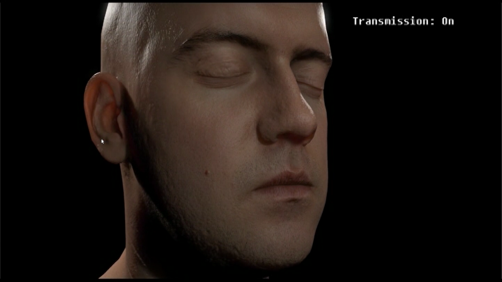

# DemoDisplay

[toc]

### 基于虚拟视点的实时半透明材质渲染

效果截图：

效果对比：

translucent shadow map &emsp;&emsp;&emsp;&emsp;&emsp;&emsp;&emsp;&emsp;&emsp;&emsp;&emsp;&emsp;&emsp;&emsp;&emsp;&emsp;	 our method

效率对比：

### 峨眉山实时渲染

### VR照片墙

### HIVE-实时渲染引擎

### Shadertoy Shaders

shadertoy主页： https://www.shadertoy.com/user/ikuto 

Procedural modeling, shading and animation

