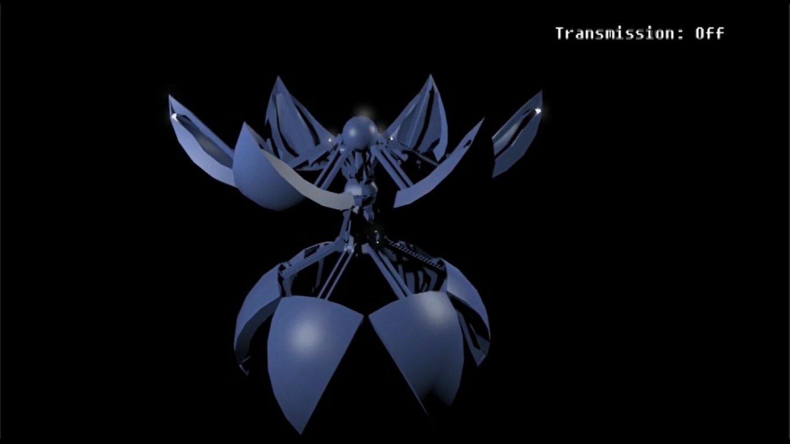

[toc]

# 基于虚拟视点的实时半透明材质渲染

**效果截图：**

**效果对比：**

<table>
    <tr>
      <td width="50%">

Transmission Off

</td>
      <td width="50%">

Transmission On

</td>
    </tr>
    <tr>
      <td width="50%">
Translucent Shadow Map
</td>
      <td width="50%">
Our Method
</td>
    </tr>
    <tr>
      <td width="50%">
Translucent Shadow Map
</td>
      <td width="50%">
Our Method</td>
    </tr>
</table>

# 峨眉山实时渲染

# VR照片墙

**效果截图：**

# HIVE-实时渲染引擎

# Shadertoy Shaders

shadertoy homepage： https://www.shadertoy.com/user/ikuto 

All effects below are generated using procedural modeling, shading and animation.
<table algin = "center">
    <tr>
      <td width="50%">
transparency+translucency
</td>
      <td width="50%">
translucency
</td>
    </tr>
    <tr>
      <td width="50%">
eye rendering + subsurface scattering
</td>
      <td width="50%">
voronoi noise
</td>
    <tr>
      <td width="50%">
toon shading
</td>
      <td width="50%">
clouds using 3d perlin noise
</td>
    </tr>
    <tr>
      <td width="50%">
volumetric + translucent
</td>
      <td width="50%">
fractal tree
</td>
    </tr>
    <tr>
      <td width="50%">
simple water
</td>
      <td width="50%">
physically based shading
</td>
    </tr>
</table>