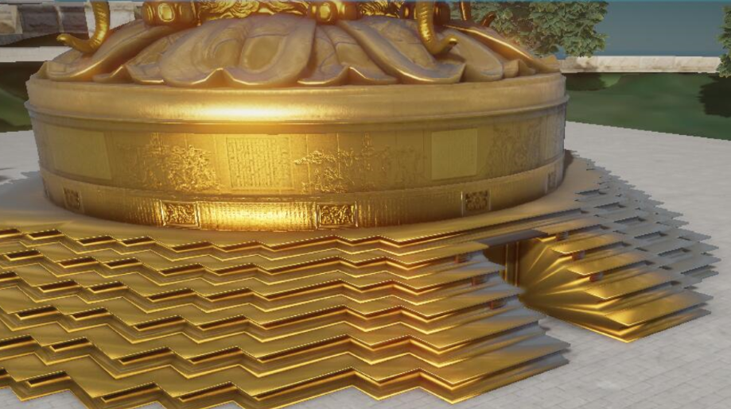
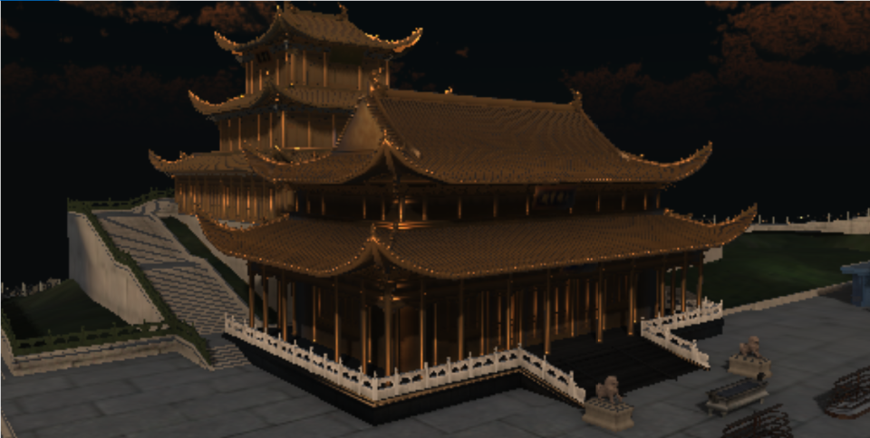

# 成果展示

目录
- [基于虚拟视点的实时半透明材质渲染](#基于虚拟视点的实时半透明材质渲染)
- [峨眉山实时渲染](#峨眉山实时渲染)
- [VR照片墙应用](#VR照片墙)
- [Shadertoy Shaders](#Shadertoy%20Shaders)

 

## 基于虚拟视点的实时半透明材质渲染

**效果截图：**

**效果对比：**

<table>
    <tr>
      <td width="50%" align = "center">Transmission Off</td>
      <td width="50%" align = "center">Transmission On</td>
    </tr>
    <tr>
      <td width="50%" align = "center">Translucent Shadow Map</td>
      <td width="50%" align = "center">Our Method</td>
    </tr>
    <tr>
      <td width="50%" align = "center">Translucent Shadow Map</td>
      <td width="50%" align = "center">Our Method</td>
    </tr>
</table>

## 峨眉山实时渲染

**效果截图：**

  
  
  PBR + IBL + Bloom + HDR

  
  Procedural Sky + Atmoshpere Scattering

<table>
  <tr>
    <td width="50%" align = "center">Cascaded Shadow Map (far)</td>
    <td width="50%" align = "center">Cascaded Shadow Map (near)</td>
  </tr>
</table>

<table>
    <tr>
      <td width="50%" align = "center"></td>
      <td width="50%" align = "center"></td>
    </tr>
    <tr>
      <td width="50%" align = "center">No AA</td>
      <td width="50%" align = "center">TAA</td>
    </tr>
</table>

<table>
    <tr>
      <td width="50%" align = "center">No AO</td>
      <td width="50%" align = "center">SSAO</td>
    </tr>
</table>

## VR照片墙

**效果截图：**

## Shadertoy Shaders

我的shadertoy主页： https://www.shadertoy.com/user/ikuto 

All effects below are generated using procedural modeling, shading and animation.

<table>
    <tr>
      <td width="50%" align = "center">transparency+translucency</td>
      <td width="50%" align = "center">translucency</td>
    </tr>
    <tr>
      <td width="50%" align = "center">eye rendering + subsurface scattering</td>
      <td width="50%" align = "center">voronoi noise</td>
    <tr>
      <td width="50%" align = "center">toon shading</td>
      <td width="50%" align = "center">clouds using 3d perlin noise</td>
    </tr>
    <tr>
      <td width="50%" align = "center">volumetric + translucent</td>
      <td width="50%" align = "center">fractal tree</td>
    </tr>
    <tr>
      <td width="50%" align = "center">simple water</td>
      <td width="50%" align = "center">physically based shading</td>
    </tr>
</table>

